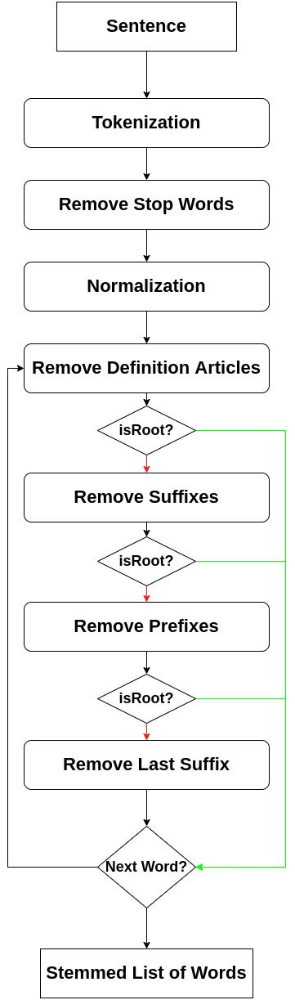

# Gezr - Light-based Arabic Stemmer 

Gezr is a light-based Arabic stemmer using rules applied based on token length.

- Refer to [the example notebook](Example.ipynb) to learn how to use it, and see an output example.

## Algorithm

- Refer to [the algorithm](Algorithm.md) for the algorithm steps.

## References

- Alshalabi, H., Tiun, S., Omar, N., AL-Aswadi, F. N., & Alezabi, K. A. (2021). Arabic light-based stemmer using new rules. Journal of King Saud University-Computer and Information Sciences.

- Al-Kabi, M. N., Kazakzeh, S. A., Ata, B. M. A., Al-Rababah, S. A., & Alsmadi, I. M. (2015). A novel root based Arabic stemmer. Journal of King Saud University-Computer and Information Sciences, 27(2), 94-103.

